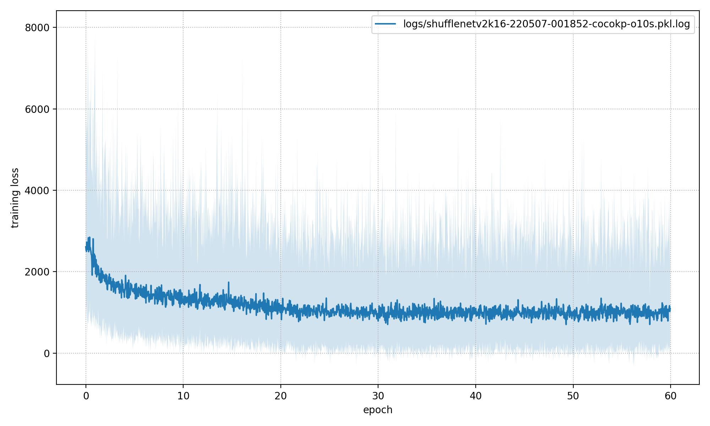
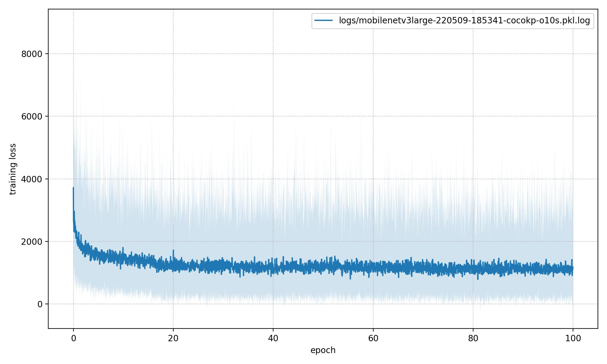
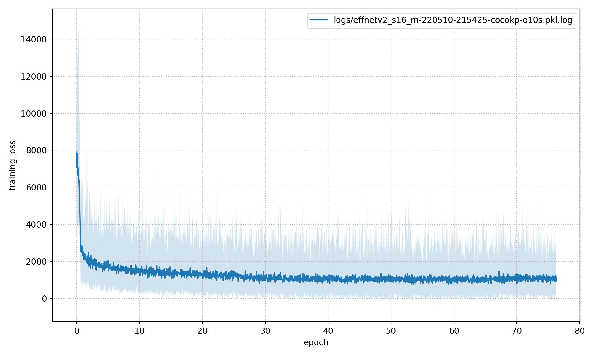

# OpenPifPaf: Performance vs Efficiency 

## Training: 
To train the Openpifpaf model, you mgiht use the follwoing command: 
python train.py 

Options: 
Learning rate: --lr  
Learning rate decay: --lr-decay 
Momemtum: --mometum 

Evaluation: python eval.py 

Plots of loss per epoch: 

  
  
  

